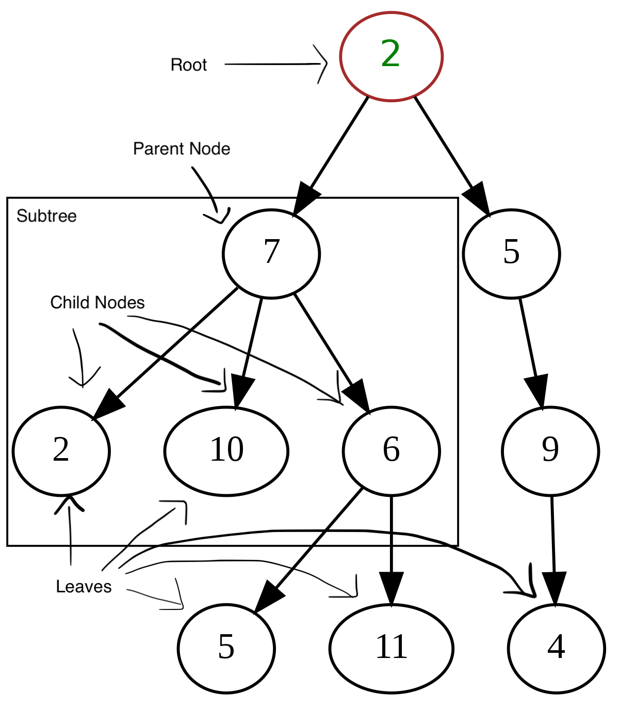

# Trees

A **tree** organizes data similarly to a linked list, in that the data is stored in memory not by index but by pointers that connect nodes to each other. A tree's nodes can point to many different nodes, however. Here is a diagram of a tree:



Every tree has one **root** node at its top, from which all other nodes are connected like the branches of a tree. Every node that connects to other lower nodes is a **parent** node, and all the nodes below it are **child** nodes of that parent node. The parent node and the child nodes of that parent form a **subtree**. Nodes that don't connect to any lower nodes are called **leaf** nodes.

Let's learn about one of the types of trees commonly used in programming and what it's used for.

## Binary Trees

A **binary tree** is a tree in which each parent node can only directly connect to up to two child nodes. They look generally like this:


Each node may connect to one or two child nodes, but may not be connected to more. We can see that the subtree starting with the node labeled 2 is a **perfect binary tree**. This means that each parent node is connected to two child nodes, and all the leaves are at the same depth. The whole tree is not a perfect binary tree because the nodes labeled 6 and 7 both only connect to one child node.

The tree we're learning about is a type of binary tree, called a binary search tree. Let's learn about it.

## Binary Search Trees

A **binary search tree** is a type of binary tree in which the data is organized such that each **left node** (child node to the left of the parent) is smaller than the parent node, and the **right node** (child node to the right of the parent) is larger than the parent node. Take a look at this tree:


In this tree, the root node is 8. Its left child is 3, which is smaller than 8, and its right child is 10, which is larger than 8. This pattern continues for the entire tree.

If we want to insert a number into this tree, we need to compare it with each number and move it along the tree until we find where it goes. For example, if we wanted to add the number 2 to the tree, we follow these steps:

1. Compare it with the root. Since 2 < 8, we move to the left child of 8.
2. Compare it with 3. Since 2 < 3, we move to the left child of 3.
3. Compare it with 1. Since 2 > 1, we move it to the right of 1.
4. Since there is no node to the right of 1, we can insert 2 as the right child of 1.

Sorting a BST (Binary Search Tree) is generally more efficient than sorting an array or a linked list. Instead of having to traverse through the entire list and compare each number with every other number to see where it goes (which takes O(n) time), we compare each number with half the tree, cutting off almost half the tree every time as we search for the place to put the new number. This makes its performance take O(log n) time. However, this is because the tree above is a **balanced BST**.

## Balanced Binary Search Trees

Finally, we've arrived at the final form of tree we're learning about: a balanced binary search tree. This is a binary search tree in which the diiference between the height of any two subtrees is not drastically different. There are a few different definitions of balanced between different programmers and different algorithms, some more strict than others. A perfectly balanced tree would have all leaf nodes at the same height from the root node, and would operate perfectly at O(log n) time. The further the distance between the height of the furthest leaf and the nearest leaf to the root, the further from O(log n) time operations will take.

Balanced BST:


Unbalanced BST:


The only way to guarantee O(log n) performance for a BST is for the BST to be balanced. This is because O(log n) time implies that you are continuously cutting the list in half as you search or apply other operations to the BST. However, you are not doing that when your tree is unbalanced. Take a look at an extreme example of this:


This is technically a BST, but looks more like a linked list. Traversing or inserting into this BST would take O(n) time because there is no splitting the data. The further unbalanced your tree is, the closer to O(n) time it will take to perform operations on it.

### How Do We Balance Our BST?

There are several algorithms that have been created to form BSTs. Some common algorithms are red black trees or AVL (Adelson-Velskii and Landis) trees. The algorithms are designed to keep the tree balanced through insertions and deletions by rotating the nodes. An AVL example uses the first unbalanced tree above. If the 13 is put in the place the 14 is, the 14 can go to the right of the 13 and maintain balance.


To create a BST that is balanced from a list of sorted numbers, here is a sample program of what that might look like:

```python
def create_bst_from_sorted_list(sorted_list):
    """
    Given a sorted list (sorted_list), create a balanced BST.
    """
    bst = BST()  # Create an empty BST to start with 
    _insert_middle(sorted_list, 0, len(sorted_list)-1, bst, None)
    return bst

def _insert_middle(sorted_list, first, last, bst, remember):
    """
    This function will attempt to insert the item in the middle
    of 'sorted_list' into the 'bst' tree recursively until every item from the list is added.
    """
    if not sorted_list:
        return
    
    if remember is None:
        remember = []

    index = math.floor(last - ((last - first) / 2))

    # Allows program to skip indices that have already been added to the BST
    if index in remember:
        return
    else:
        remember.append(index)

    bst.insert(sorted_list[index])
    
    _insert_middle(sorted_list, first, index, bst, remember)
    _insert_middle(sorted_list, index + 1, last, bst, remember)
```

The basic premise of the program is that if we insert the middle number of each group first, then the tree will have equal amounts of numbers on each side of any given subtree and the tree itself. This tree would be balanced.

### Time Efficiency: Big O

Here are the most common operations in a balanced BST and their time efficiency:

|             | Operation Efficiency   | Explanation                                      |
|:------------|:-----------------------|:-------------------------------------------------|
| Insert item | O(log n)               | Recursive; searches for spot                     |
| Delete item | O(log n)               | Recursive; searches for node                     |
| Traverse    | O(log n)               | Recursive; traverse left subtree and then right  |
| Get height  | O(log n)               | Recursive; gets height of left and right subtree |

## Problem to Solve

Write a function to insert a new value into a BST. You can use the code provided to start you off:

```python
class BST:
    class Node:
        def __init__(self, data):
            self.data = data
            self.left = None
            self.right = None

    def __init__(self, root=None):
        self.root = root

    def insert(self, value):
        '''
        Inserts a new root if needed. Runs the insert function.
        '''
        if self.root == None:
            self.root = BST.Node(value)
        else:
            self._insert(value, self.root)
    
    def _insert(self, value, node):
        '''
        ***THIS IS THE FUNCTION TO FILL IN***

        Inserts a new value into the BST. If there is no root in the BST, 
        make the value the new root. If the value already exists in the BST,
        do not add the value.
        '''
        pass

    def __iter__(self):
        '''
        Traverses forward through BST as iterator
        '''
        yield from self.traverse_forward(self.root)
    
    def traverse_forward(self, node):
        '''
        Traverses forward through BST
        '''
        if node is not None:
            yield from self.traverse_forward(node.left)
            yield node.data
            yield from self.traverse_forward(node.right)

print
bst = BST()
bst.insert(7)
bst.insert(9)
bst.insert(3)
bst.insert(3)
bst.insert(5)
bst.insert(11)
bst.insert(8)

for item in bst:
    print(item) # Expected output: 3 5 7 8 9 11
                # Note that 3 only appears once
```

You need to insert the value at the appropriate position in the BST. If the BST doesn't have a root, make the value the new root. Do not allow for duplicate values. 

Make sure to run the program when you are done and check the tests for the proper output.

Here is a [solution](trees.py) to the problem. Note that your solution may look different, but that does not mean it is wrong. If your program passes all the tests required to complete the task, it is a valid solution. This is just one valid solution.